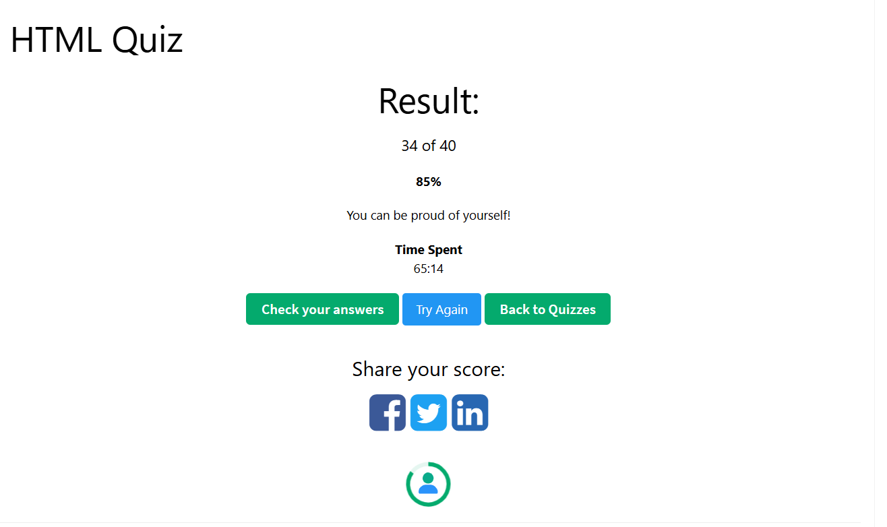

# Task 4 - HTML Cafe Website

## 1) Website HTML
I have created the HTML structure for the given cafe website and saved it as `index.html`.

## 2) W3Schools HTML Quiz
I have solved the required W3Schools quiz and achieved a passing score of 85%.

### Quiz Result:

## 3) Live Website
[Live Demo of the Website](https://www.w3schools.com/w3css/tryw3css_templates_cafe.htm#)